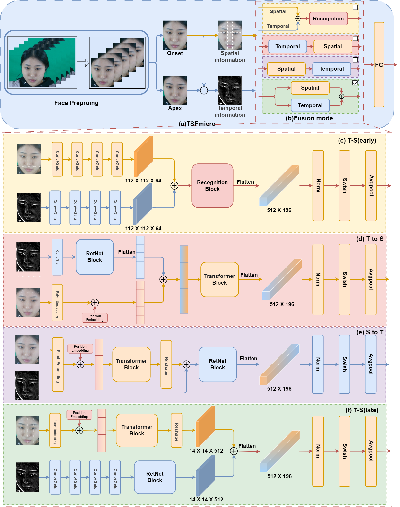

<h1>TSFmicro</h1> 
 Temporal and Spatial Feature Fusion Framework for Dynamic Micro Expression Recognition

 

## Abstract
When emotions are repressed, an individual's true feelings may be revealed through micro-expressions. Consequently, micro-expressions are regarded as a genuine source of insight into an individual's authentic emotions. However, the transient and highly localised nature of micro-expressions poses a significant challenge to their accurate recognition, with the accuracy rate of micro-expression recognition being as low as 50\%, even for professionals. In order to address these challenges, it is necessary to explore the field of dynamic micro expression recognition (DMER) using multimodal fusion techniques, with special attention to the diverse fusion of temporal and spatial modal features. In this paper, we propose a novel Temporal and Spatial feature Fusion framework for DMER (TSFmicro). This framework integrates a Retention Network (RetNet) and a transformer-based DMER network, with the objective of efficient micro-expression recognition through the capture and fusion of temporal and spatial relations. Meanwhile, we propose a novel parallel time-space fusion method from the perspective of modal fusion, which fuses spatio-temporal information in high-dimensional feature space, resulting in complementary “where-how” relationships at the semantic level and providing richer semantic information for the model. The experimental results demonstrate the superior performance of the TSFmicro method in comparison to other contemporary state-of-the-art methods. This is evidenced by its effectiveness on three well-recognised micro-expression datasets.
## Overview
An overview of the proposed TSFmicro architecture is presented below. (a)The process of TSFmicro is outlined as follows: firstly, the face is cropped; secondly, the difference frames between Apex and Onset frames are used as the temporal information and Onset frames are used as the spatial information; thirdly, the spatio-temporal sub-branch captures and fuses the spatio-temporal information; and finally, the data is categorized. (b) Fusion module. (c) The structure of the T to S (early) fusion approach. (d) The structure of the T to S fusion approach. (e) Structural delineation of the S-to-T fusion approach. (f) The structure of the T-S (late) fusion approach.

